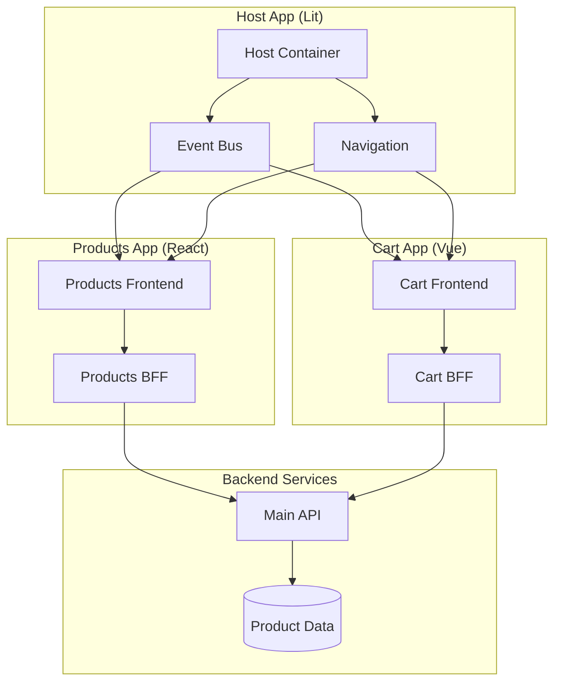

# Shop Microfrontends Project

The `shop-microfrontends` project is designed to demonstrate a microfrontends architecture using modern web technologies, including React, Vue, and ASP.NET Core. This architecture allows for independent development, deployment, and scaling of different parts of a web application, enhancing modularity and maintainability.

## Purpose

The primary purpose of this project is to showcase how microfrontends can be implemented, combining different frameworks and how communication can flow through each module following good practices.

## Architecture Overview



The project consists of the following components:

1. **Product App**: A React-based microfrontend responsible for displaying a list of products and detailed information about each product. It fetches product base data from the `main-api` and enriches it with it's own view data through the BFF. The app smoothly requests /api/{route} hitting the BFF.

2. **Cart App**: A Vue-based microfrontend that manages the shopping cart functionality. It provides features for adding products to the cart and viewing the current cart contents. The cart state is managed using Vue's composition API and Pinia.

3. **Host App**: The main application shell that integrates all microfrontends. The Host App serves as the application shell, built using Web Components with the Lit library. 

    - **Container Layout**: A container layout system with navigation and content areas
    - **Routing System**: Client-side routing that manages navigation between microfrontends through a simple yet effective event delegation system.
    - **Event Bus Communication**: A centralized event bus that enables cross-microfrontend communication through a pub/sub pattern:
        - `dispatch`: Broadcasts events with data to all subscribers.
        - `subscribe`: Allows microfrontends to listen for specific events.
        - Event queueing system to handle asynchronous microfrontend loading.
    - **Microfrontend Integration**: 
        - Loads microfrontends via iframes in a dedicated container.
        - Provides isolation between different microfrontend contexts.


4. **Main API**: An ASP.NET Core Web API that serves as the backend for the application. It provides endpoints for retrieving product data and managing the shopping cart. The API is built using a simple controller-based architecture, with endpoints for accessing products and cart information. In a larger application this can be an api gateway to update/retrieve data from the system.

## Key Features

- **Independent Development**: Each microfrontend can be developed and deployed independently, allowing teams to work in parallel and choose the best tools for their specific needs.
- **Shared Components and Dependencies**: Common components and dependencies are shared across microfrontends to reduce duplication and ensure consistency.
- **Runtime Integration**: Module Federation enables runtime integration of microfrontends.
- **Centralized State Management**: The host app manages global state and routing. The design principle is that the microfrontends communicate through eventing, where application state for each is hydrated using the backend. That is, the microfrontends are loosely coupled and don't share presentation state. Then, each microfrontend can handle its application state using different tools like pinia for Vue or redux for react.

## Installation and Setup

### Prerequisites

- Just Docker

nginx is used as a reverse proxy to handle routing and communication between services.

### Setup

Build and start the Docker containers. Navigate to the root directory of the project where the docker-compose.yml file is located and run:

```bash
docker-compose up --build
```

Once the containers are up and running, you can access the main application at http://localhost.

This command will build the Docker images for each service defined in the docker-compose.yml file and start the containers. The services include:

- host-app: The main application shell.
- main-api: The backend API service.
- cart-app: The microfrontend responsible for cart functionality.
- products-app: The microfrontend responsible for displaying products.
- nginx: Acts as a reverse proxy to route requests to the appropriate services.
- (still To be done) shared-components: Contains shared components used by other microfrontends.

# References

- Microfrontends fundamentals: https://martinfowler.com/articles/micro-frontends.html
- Tools:
    - https://lit.dev/
    - https://vite.dev/
